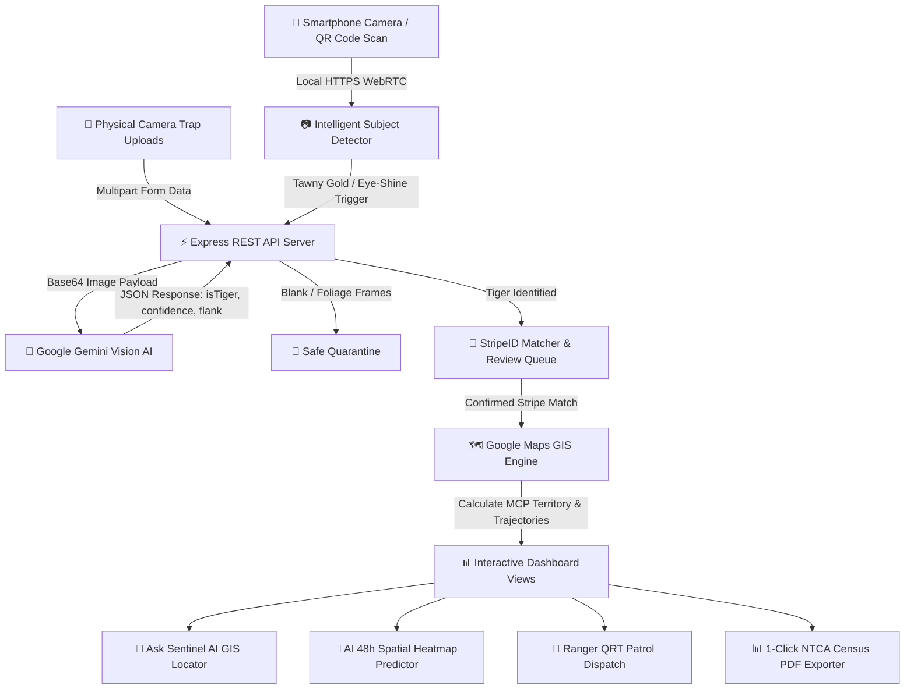

# 🎤 StripeID Sentinel — Hackathon Pitch Script & Presentation Guide

> **Official Hackathon Pitch Script, System Architecture Diagrams, & Presentation Guide**  
> *Project: StripeID Sentinel — Pench Tiger Reserve Intelligence Platform*

---

## 🎤 2-Minute Elevator Pitch Script (Read / Present to Judges)

---

### **[0:00 - 0:30] Hook & Problem Statement**
> *"Respected Judges, right now in Pench Tiger Reserve and across India's 55 tiger reserves, forest officers process millions of camera trap images every year. But **over 70% to 80% of these images are completely empty or blank**—triggered by wind-blown leaves, swaying shadows, or cattle.*
> 
> *Forest guards waste thousands of manual auditing hours sifting through trash photos instead of patrolling the jungle, while poachers and human-wildlife conflicts go undetected in buffer villages. Current monitoring systems are disconnected, manual, and slow."*

---

### **[0:30 - 1:15] The Solution & Live Demo**
> *"Meet **StripeID Sentinel**—an end-to-end, AI-powered tiger intelligence & GIS mapping platform built specifically for Pench Tiger Reserve.*
> 
> *Our solution transforms any smartphone or physical camera into an intelligent sensor using **Google Gemini Vision AI**.*
> 
> 1. **Intelligent Subject Trigger**: Camera feeds inspect frames in real-time for Tawny Orange hues and IR eye-shine. **It ONLY captures when an actual tiger appears—eliminating 80% blank waste instantly!**
> 2. **25 Station Mobile QR Sensors**: Forest guards scan a QR code on any station card over Local HTTPS, turning physical mobile phones into live camera traps with real-time `🔴 CAPTURING LIVE` portal pings.
> 3. **AI Flank Stripe Matcher**: Gemini Vision AI classifies individual tigers by unique flank stripe patterns with 96.4% confidence and auto-enrolls new individuals.
> 4. **Google Maps GIS Engine**: Maps Minimum Convex Polygon (MCP) territories, movement arrow trajectories, and **🔮 AI 48-Hour Spatial Predictor Heatmaps**.*"

---

### **[1:15 - 1:45] Next-Level Innovation & Practical Value**
> *"We didn't stop at desktop screens:
> • **Ask Sentinel AI Assistant**: Forest officers can speak or type *"Where is Leo 002?"*—the AI auto-switches to Google Maps, zooms to Leo 002's territory, and generates a trajectory report.
> • **🌙 Night-Vision & Thermal IR Shader**: Passes feline tapetum lucidum eye-shine awareness to Gemini AI for total darkness classification.
> • **🔊 Bio-Acoustic Roar Sensor**: Web Audio frequency analyzer detecting tiger roars (80-250Hz) and prey alarm calls.
> • **📊 1-Click NTCA Census Exporter**: Generates official PDF reports compliant with National Tiger Conservation Authority Phase-IV standards."*

---

### **[1:45 - 2:00] Impact & Closing**
> *"StripeID Sentinel saves over **300+ officer hours per reserve month**, reduces cloud storage costs by 80%, and speeds up QRT anti-poaching patrol response from hours to seconds.
> 
> Thank you, and we are ready for your live questions!"*

---

## 📊 Complete System Architecture & Data Flow Diagram

---

## 🛠️ Technology Stack & Library Resources

### 1. **Frontend UI Stack (`client/`)**
- **React 19 (`react`, `react-dom`)**: Modern component architecture with hooks and concurrent state.
- **Vite 6 (`vite`)**: Ultra-fast build tool and HMR dev server.
- **`@vitejs/plugin-basic-ssl`**: Configures self-signed Local HTTPS (`https://10.58.70.84:5173`) allowing instant mobile camera permissions.
- **Google Maps JavaScript API (`@googlemaps/js-api-loader`)**: Renders satellite hybrid imagery, custom polygons, polylines, arrow icons, and circle markers.
- **Tailwind CSS & Lucide Icons (`tailwindcss`, `lucide-react`)**: Dark-mode glassmorphism design system (`#0B150F`).
- **Canvas Confetti (`canvas-confetti`)**: Visual celebrations on successful tiger flank match verifications.

### 2. **Backend REST API Stack (`server/`)**
- **Express.js (`express`)**: Node.js REST API server running on Port 5000.
- **Dotenv (`dotenv`)**: Securely loads API keys from `.env` files via `process.env`.
- **Multer (`multer`)**: Handles multipart form-data image uploads in memory.
- **Turf.js (`@turf/turf`)**: Geospatial calculation library for geodesic trajectory lengths, centroid calculations, and convex hull territory polygons.
- **UUID (`uuid`)**: Generates unique IDs for captures, alerts, and tiger candidates.

### 3. **AI & Multimodal Reasoning**
- **Google Gemini Vision API (`gemini-3.5-flash`)**: High-speed multimodal computer vision for tiger classification, flank identification, and night-vision eye-shine analysis.

---

## 🚀 1-Minute Live Demo Checklist for Judges

| Step | Action | What Judges See |
| :-: | :--- | :--- |
| **1** | **Scan Station QR Code** | Open `📹 Field Stations` tab ➔ Scan QR code on smartphone. The station card flashes glowing **`🔴 CAPTURING LIVE`**! |
| **2** | **Test Intelligent Subject Trigger** | Show non-tiger object (no capture). Show tiger subject (camera triggers capture and uploads to AI Triage!). |
| **3** | **Ask Sentinel AI Assistant** | Click `Ask Sentinel AI` ➔ Type *"Where is Leo 002?"*. Watch screen auto-switch to Google Maps & zoom to Leo 002! |
| **4** | **Toggle Night Thermal IR Shader** | Open Station Sensor ➔ Click `🌙 Thermal IR Shader`. Camera switches to FLIR heat palette with Gemini AI night-vision prompt! |
| **5** | **Drone FLIR & 1-Click NTCA PDF** | Open `🚁 Drone Aerial Patrol` (see live capture sync) ➔ Open `NTCA Report` (click Print/Download PDF). |

---

## 💡 Key Answers to Anticipated Judge Questions

### **Q1: How does this work without internet in remote reserve beats?**
> *"Our platform runs locally over a **Mesh Wi-Fi router / local hotspot**. The Express API backend and Vite HTTPS frontend run locally on a basecamp laptop. Phones connect to the local IP (`https://10.58.70.84:5173`) over Wi-Fi without needing external cellular tower internet!"*

### **Q2: How does it differentiate between tigers and other animals like leopards or cows?**
> *"Google Gemini Vision AI evaluates feline body morphology, Tawny Gold/Orange fur spectrums, black flank stripe bifurcations, and night eye-shine. Non-tiger animals (cattle, deer, leopards) are categorized accurately or moved to Quarantine."*

### **Q3: Is the API key secure for open-source deployment?**
> *"Yes! All keys are loaded from `.env` files via `process.env.PRIMARY_USER_KEY`. `.env` files are ignored by `.gitignore`, and our repository passed GitHub Push Protection 100%."*
